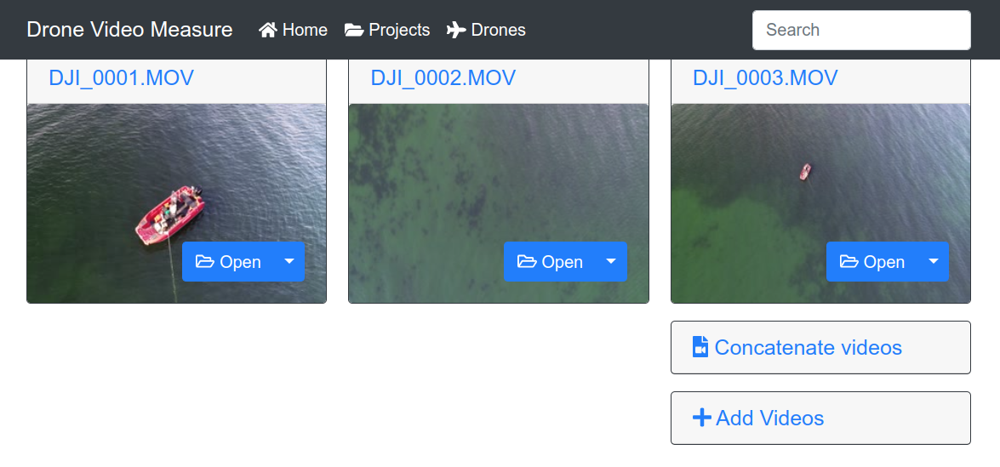
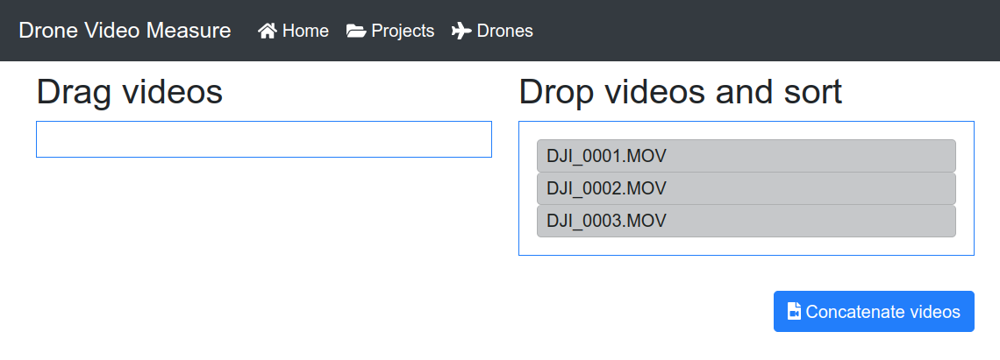
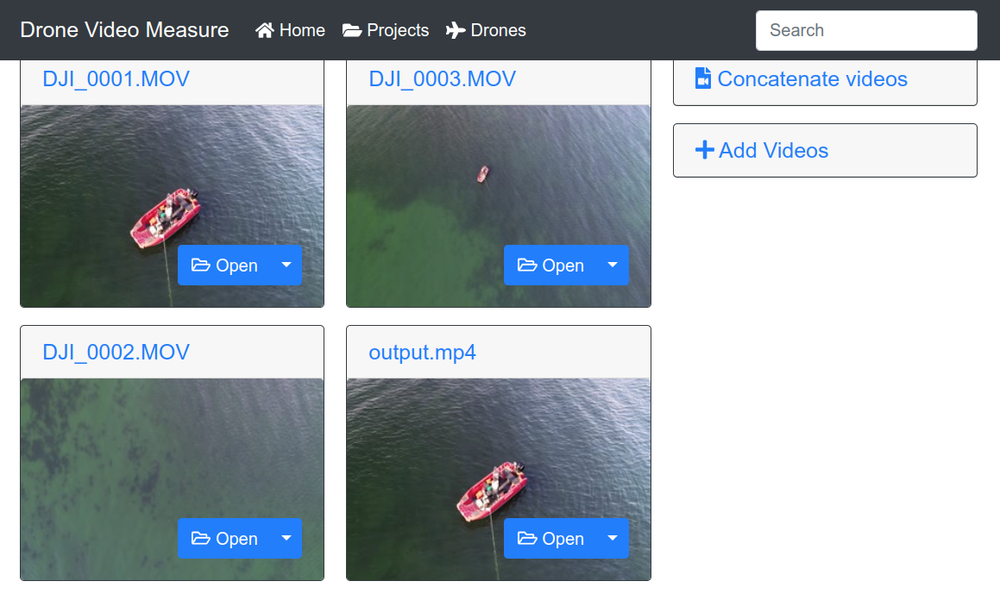

# Concatenate videos

In the case that there are more than one file for a video recording, it is possible to concatenate the videos. This is usually the case when recording long videos (10 minutes or more) where DJI drones would split them into separate files.

To concatenate such files, upload them to a project, and then click on the **Concatenate video** button.

In the next screen, you have to choose the order in which the separate files should be concatenated. When the files are ordered as desired, click on the **Concatenate videos** button.

Then the selected videos will be concatenated a new video will appear in the project. Please be patient as the concatenation process can take several minutes.

