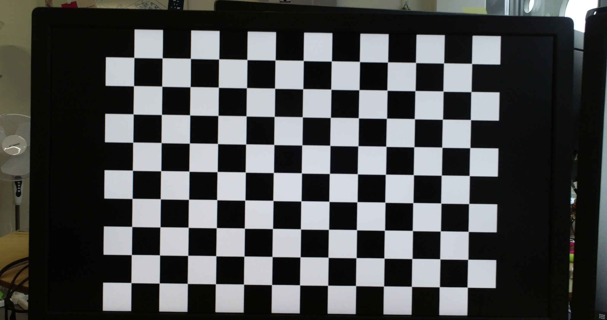
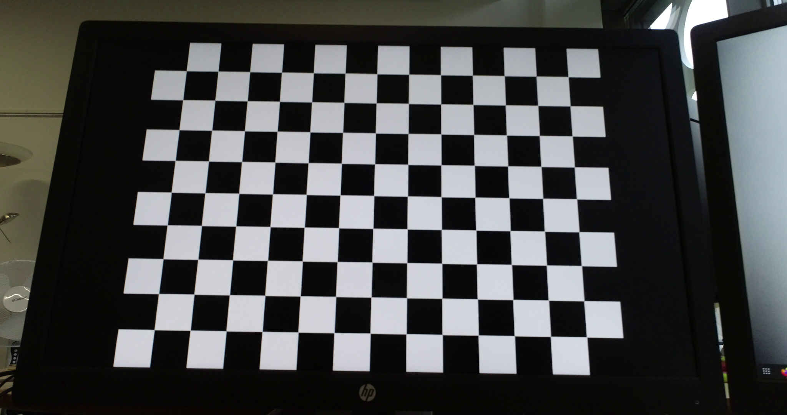
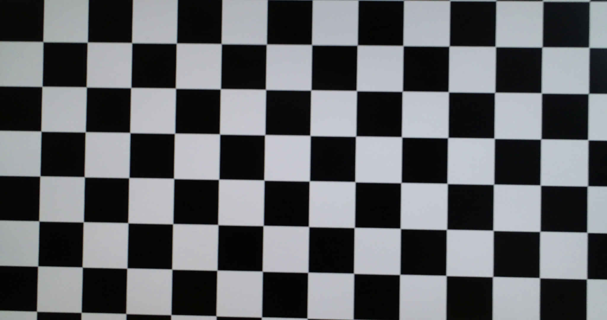
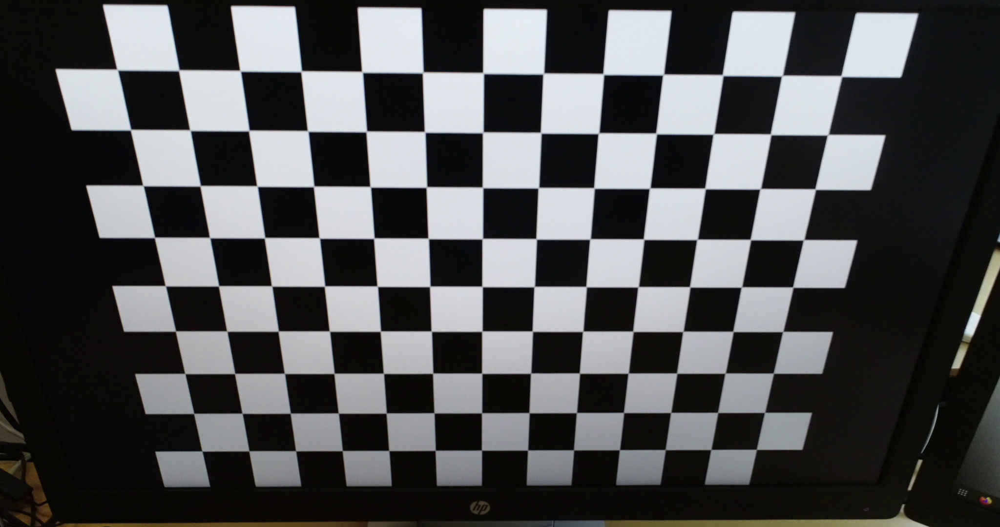

# Record a camera calibration video

To record a camera calibration video you need the following:

- a flat monitor
- a chessboard calibration pattern
- the camera to calibrate

The chessboard calibration pattern can be downloaded from
[calib.io](https://calib.io/pages/camera-calibration-pattern-generator)

The next step is to record a video of the calibration pattern, in which the camera orientation relative to the pattern is varied. See the example images below. It is not needed to have the entire calibration pattern be visible in each part of the video.

```{Note}
It is important that the camera settings i.e. resolution, zoom etc. used to make the calibration video is the same as the videos for annotation.
```








