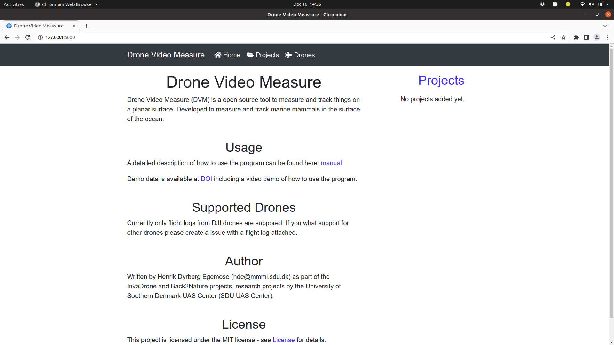
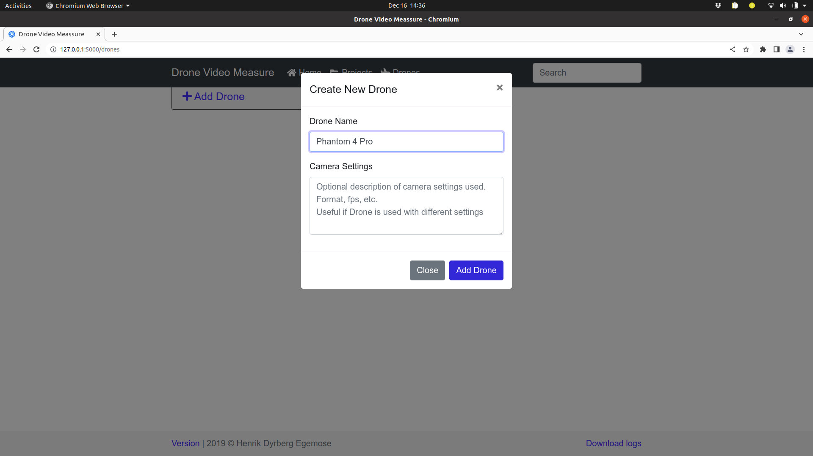
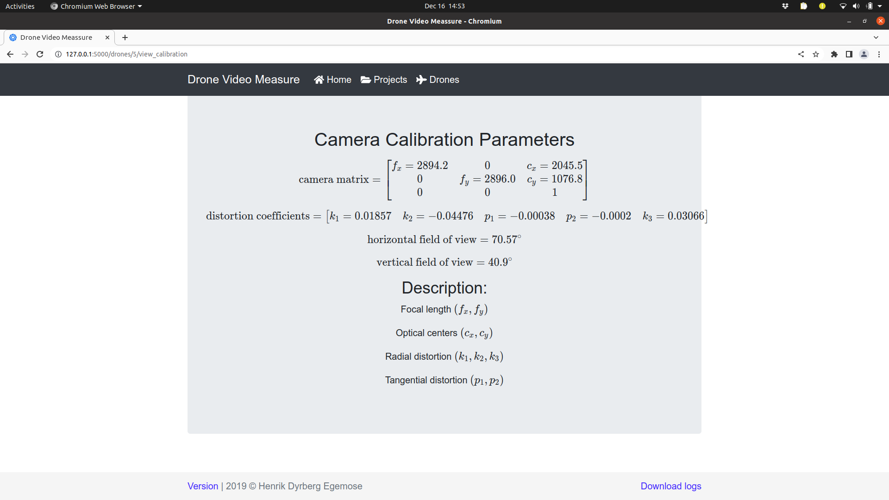

# Tutorial - Getting stared with Drone Video Measure

This tutorial will guide you through the steps of using the Drone Video Measure programme. The following dataset on zenodo will be used as an example.
-  

The dataset contains the following elements that will be used in this tutorial
- A video of a chess board calibration target
	- `calibration.MOV`
- A logfile file from a DJI Phantom 4 Pro drone
	- `DJIFlightRecord_2018-07-04_[11-19-31].csv`
- A video recorded by a DJI Phantom 4 Pro drone
	- `DJI_0013.MOV`

This tutorial assumes that you already have installed the Drone Video Measure program and opened the interface in your browser on this link http://localhost:5000. You should now see this screen. If not please consult the installation guide linked to below.
- [[Howto - Install Drone Video Measure]]

## Overview
To analyse the video, the following three steps should be taken.
1. Determine the camera parameters of the used camera
2. Add a new project based on the logfile from the drone
3. Add a new video that matches the uploaded logfile

## 1. Determine the camera parameters of the used camera
In this step camera parameters like field of view, focal length and lens distortions are estimated. All these parameters can be determined based on a video of a chessboard calibration target. The process is described here.

### 1.1 Create a new drone in DVM
Click on the "Drones" tap in the top most part and then click on the "Add Drone" button. This will open a new dialog, where information about the drone can be entered. 
Fill out the Drone Name with "Phantom 4 Pro" and then click "Add Drone".

### 1.2 Upload a calibration video to DVM
Click on the small down arrow next to the "Edit" button and select "Camera calibration".  At this point the page will be changed so that you can upload the calibration movie.
From the file explorer drag the `calibration.MOV` file onto the white rectangle and the file will be uploaded to DVM. This can take a minute or so.

### 1.3 Calibrate the camera
When the upload is finished you can click on the "Calibration Camera" button at the lower right corner. This will start the camera calibration process. As long as the calibration process is active an animation will be shown next to the "Phantom 4 Pro" entry in the Drones tap. The camera calibration can take a few minutes. 

### 1.4 Examine the obtained results
When the calibration process is finished, you can see the calibration results by selecting the "View Camera Calibration" option in the blue drop down menu. You will now see the following screen.

For more information about how to create a suitable calibration video see this howto:
* [[Howto - Record a calibration video]]
