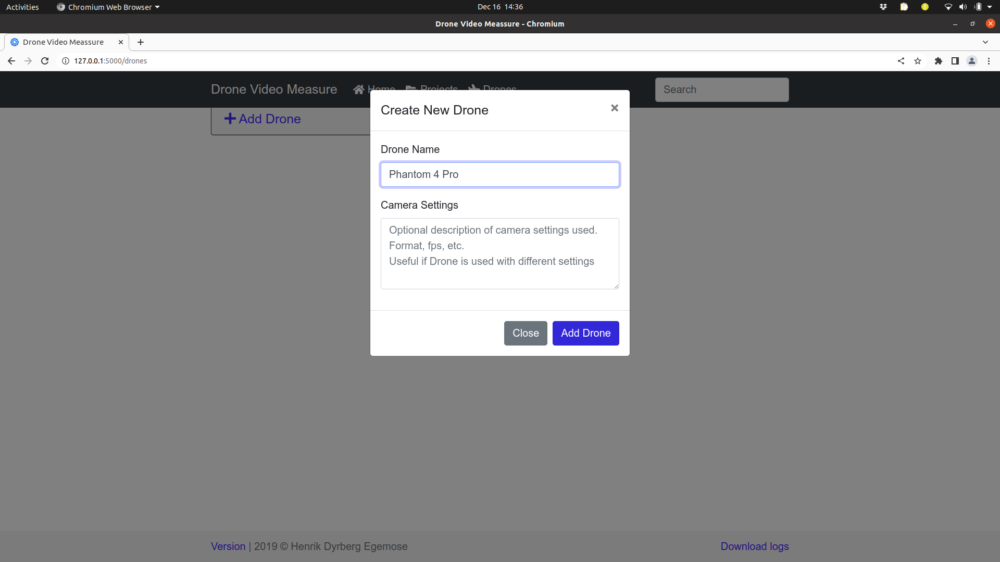
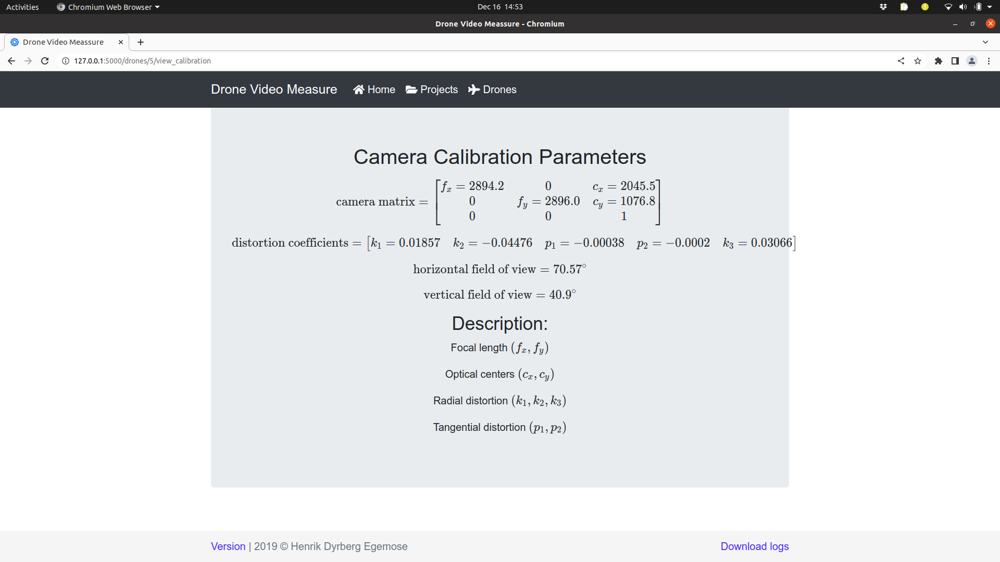

# Tutorial - Getting stared with Drone Video Measure

This tutorial will guide you through the steps of using the Drone Video Measure programme. The following dataset on zenodo will be used as an example.
- 

The dataset contains the following elements that will be used in this tutorial
- A video of a chess board calibration target
	- `calibration.MOV`
- A logfile file from a DJI Phantom 4 Pro drone
	- `DJIFlightRecord_2018-07-04_[11-19-31].csv`
- A video recorded by a DJI Phantom 4 Pro drone
	- `DJI_0013.MOV`

This tutorial assumes that you already have installed the Drone Video Measure program and opened the interface in your browser on this link http://localhost:5000. You should now see this screen. If not please consult the installation guide linked to below.
- [Howto - Install Drone Video Measure](Howto-InstallDroneVideoMeasure.md).

## Overview
To analyze the video, the following three steps should be taken.
1. Determine the camera parameters of the used camera
2. Add a new project based on the logfile from the drone
3. Add a new video that matches the uploaded logfile

## 1. Determine the camera parameters of the used camera
In this step camera parameters like field of view, focal length and lens distortions are estimated. All these parameters can be determined based on a video of a chessboard calibration target. The process is described here.

### 1.1 Create a new drone in DVM
Click on the "Drones" tap in the top most part and then click on the "Add Drone" button. This will open a new dialog, where information about the drone can be entered.
Fill out the Drone Name with "Phantom 4 Pro" and then click "Add Drone".

### 1.2 Upload a calibration video to DVM
Click on the small down arrow next to the "Edit" button and select "Camera calibration".  At this point the page will be changed so that you can upload the calibration movie.
From the file explorer drag the `calibration.MOV` file onto the white rectangle and the file will be uploaded to DVM. This can take a minute or so.

### 1.3 Calibrate the camera
When the upload is finished you can click on the "Calibration Camera" button at the lower right corner. This will start the camera calibration process. As long as the calibration process is active an animation will be shown next to the "Phantom 4 Pro" entry in the Drones tap. The camera calibration can take a few minutes.

### 1.4 Examine the obtained results
When the calibration process is finished, you can see the calibration results by selecting the "View Camera Calibration" option in the blue drop down menu. You will now see the following screen.

Well done, you have now calibrated the camera in the drone. This information together with the camera orientation and altitude will be used in estimating the location and size of objects in drone videos.

## 2. Add a new project
Now open the "Projects" tab and click on "Add Project".
Enter "Example project - Maale beach" as Project Name and ensure that the "Phantom 4 Pro" drone is selected. For the "Drone log" select the file `DJIFlightRecord_2018-07-04_[11-19-31].csv` from the zenodo dataset and then click "Add Project".

## 3. Add the video to analyse
It is now time to open the project and then add a video to the project. Click on the project title "Example project - Maale beach". This changes the view to the project tab. Here you should click on the "Add Videos" button.

Locate the video file  `DJI_0013.MOV` on your computer and drag it into the white rectangle in the middle of the view. Wait for the upload to complete and then click the blue "Convert videos" button. This will start a conversion process of the video, which might take some time. When the conversion is finished you will be taken to the video gallery.

## 4. Annotate two objects in the video
In the videe gallery click on the "DJI_0013.MOV", which is the name of the video that was just uploaded to the system. This opens the annotation view, which is where the central task of the video analysis takes place. The steps taken until now is only to ensure that everything is in place before the actual analysis is performed. The annotation view looks like this.

The warning message shown in the light yellow bos at the top, tells us that the GPS coordinate extracted from the video file and the GPS coordinate from the log file differs by 3.6 meters. This difference is safe to ignore, but if the difference is larger than 100m it could be an indication that the logfile and video does not match. Close the warning message by clicking on the x in its top right corner.

Now activate the artificial horizon, by clicking on the third lowest button in the left panel and then start the video player. This will show an artificial horizon on top of the video. The position and orientation of the artificial horizon is determined by the values from the logfile. The motion of the artificial horizon and the actual horizon should follow each other. This is a further check to ensure that the logfile and the video actually matches. The artificial horizon consists of the following elements:
- A red line indicates the direction North - South
- A blue line indicates the direction East - West
- Two green lines/circles which indicate the horizon and a direction of 45 degrees below the horizon

In the image below the video has been stopped at the time 10.67 seconds into the video. At this point the "Annotation Mode" was activated by clicking on the fourth button in the left panel. Then the mouse was placed on top of one pile of sea weed and the left mouse button was pressed down (and kept down) while the mouse was dragged to a different pile of sea weed where the left mouse key then was released. This motion of the mouse added a red arrow to the video at that specific frame. In the right panel some properties of the annotated arrow is now shown, including the length of the arrow and the frame number in which the annotation was made.

At this point you can add a some more annotations. The annotations will be shown as red arrows and points in the annotation view. You can also move to a different moment in the video and then annotate objects there.

## 5. Exporting the annotations
When the annotations are completed, they can be exported as a csv (comma separated values) file as follows. Go to the projects view and under the project "Example project - Maale beach" select "Download Annotations". At this point a file named "annotations.csv" will be saved on your computer. The downloaded file contains the following information about each annotation
- name
- time
- length
- lat
- lon
- east
- north
- zone number
- zone letter
- image_x
- image_y
- start_east
- start_north
- end_east
- end_north
- heading
- video
- project
- pro. version

## What's next?
For more information about how to create a suitable calibration video see this howto:
* [Howto - Record a calibration video](Howto-RecordACalibrationVideo.md)
For information about how to convert a logfile to the proper format, see this howto:
- [[Howto-ConvertLogfiles]]

For details about the exported annotations
- [Reference - Data export format](Reference-DataExportFormat.md)
