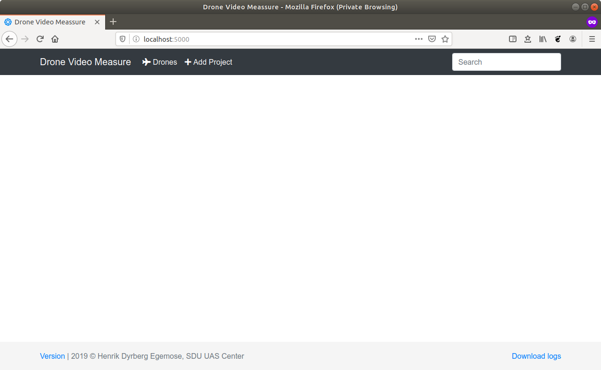
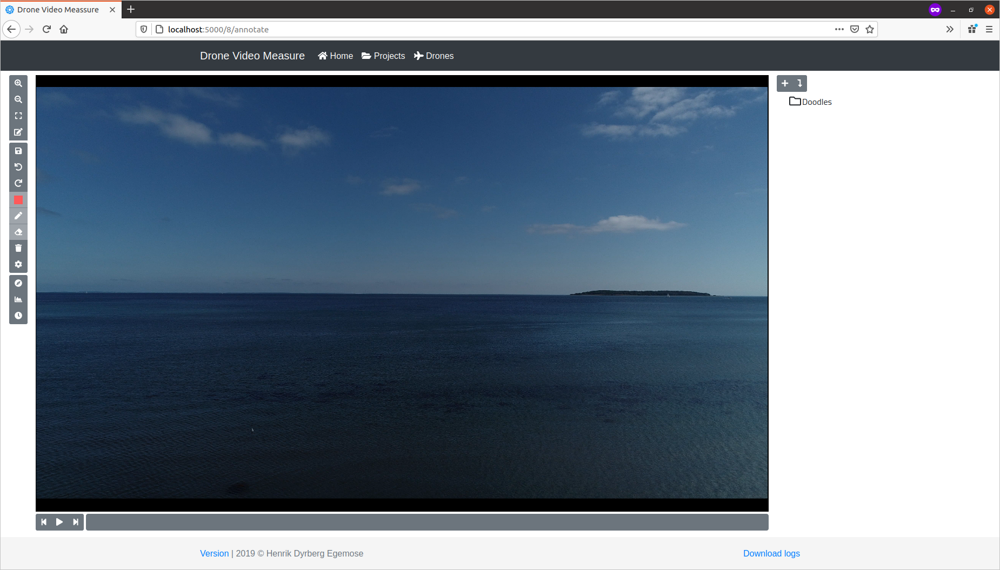
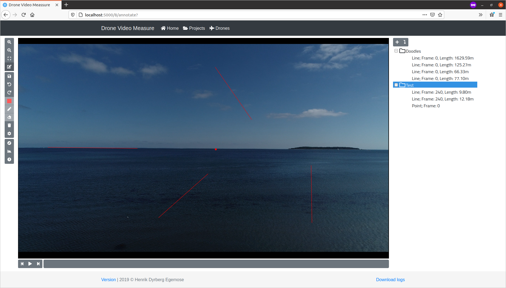
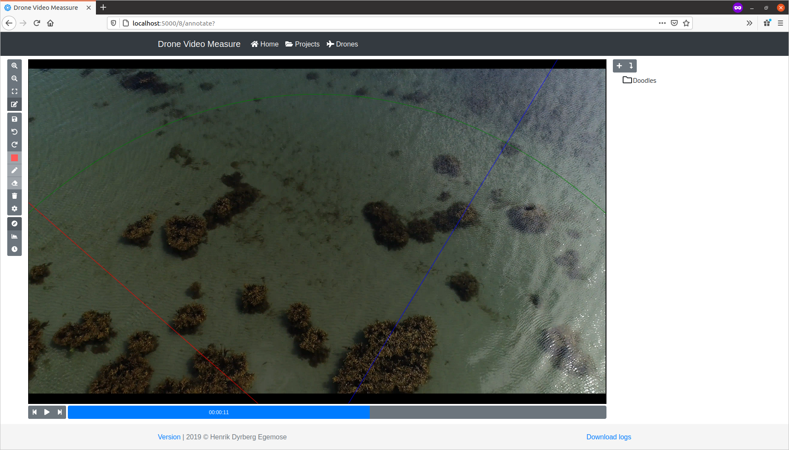
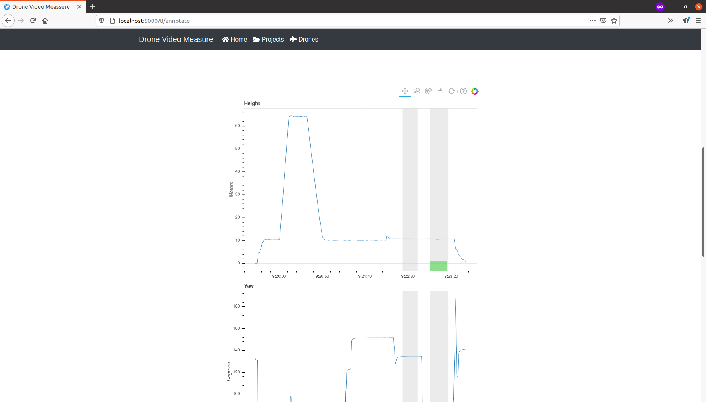

# User Manual

This is a short guide on how to use the DroneVideoMeasure program.
Given a matching flight log (from a DJI drone) and video of a marine animal, e.g. a harbor porpoise, the program lets the user track the position of the marine animal and estimate its length.

- [Installation](#installation)
- [Acquire Flight Logs](#acquire-flight-logs)
- [Using the Program](#using-the-program)
  - [Example data](#example-data)
  - [Open the program](#open-the-program)
  - [Adding and calibration of a Drone](#adding-and-calibration-of-a-drone)
  - [Creating a Project](#creating-a-project)
  - [Annotating on Video](#annotating-on-video)
    - [Artificial Compass and Flight Log Plot](#artificial-compass-and-flight-log-plot)
  - [Exporting data to csv file](#exporting-data-to-csv-file)

## Installation

To install the program, please follow the [installation guide](../README.md).

## Acquire Flight Logs

To get the flight logs from a DJI drone the following guide can be used.

- [HOW TO: Retrieve DJI Phantom Flight Logs from an Apple Device](https://www.phantomhelp.com/tips/how-to-retrieve-dji-go-flight-logs-from-itunes.29)

The flight log needs to be converted to csv format and can be done by uploading the flight log to [PhantomHelp](https://www.phantomhelp.com/LogViewer/Upload/) and Downloading the verbose csv. The verbose version is needed since the normal version lack video timestamps.

## Using the Program

### Example data

An example data set is available on [](https://doi.org/10.5281/zenodo.3604005) including a demo video.

### Open the program

The program is started by running the following command from Powershell (windows) or command line (Mac / Linux) in the folder with DroneVideoMeasure:

```bash
./dvm.sh start
```

Then open a browser (should work in all desktop browsers) and navigate to [localhost:5000](localhost:5000) and you should be greeted with a screen like this:



### Adding and calibration of a Drone

Before a project can be created a drone needs to be calibrated.

- Under the menu "Drones" click "Add Drone".
- Add the drone with a name and description (optional).
- A upload screen apears where a video of a checkerboard can be uploaded for calibration. A checkerboard is included in the repository [checkerboard.png](checkerboard.png).
- Drag and drop or click to select a video file.
- After the files is uploaded click "calibrate Camera". The drone camera is now calibrated in the background and a spinner will show the status.
- The calibration parameters can be viewed when the calibration is done by clicking "View Calibration" in the dropdown list for the given drone.

### Creating a Project

After a drone is calibrated a project can be created. The program is structured so that one project correspond to one drone flight, i.e one drone log file. The project can have multiple videos.

- Under the project page a project is created by clicking "Add Project"
- Give the project a title, description (optional), selecting a drone and upload a drone log file.
- When the project is added, open it by clicking "open"
- Clicking "add Videos" will redirect to a upload page where videos can be uploaded.
- Drag and drop or click to select one or more video file.
- After all videos are done uploading clicking "Convert Videos" will convert the videos into a format more sutable for playing in a browser.
- The videos will apear in the project and a spinner will indicate if the videos is still being converted. 
- After a video have been converted it can be open for annotations.

### Annotating on Video

After opening a video for annotation a screen like this will be showen:



A warning will show if the video metadata do not match with the drone log. This is just a indication that something can be wrong. See [Artificial Compass and Flight Log Plot](#Artificial-Compass-and-Flight-Log-Plot) for more details.

To the left is a menu with the different tools and options for annotation.
From top to Bottom:

- Zoom in.
- Zoom out.
- Return to normal zoom level.
- Toggle annotation mode vs drag mode.
- Save annotations. (Annotations are automatily saved).
- Undo last annotation.
- Redo last undo.
- If an annotation is selected, change the color.
- If an annotation is selected, change the line width.
- If an annotation is selected, delete it.
- Remove all annotations.
- Change default color and line width.
- Show a artificial horizon/compass.
- Show the flight log data under the video.
- Change the start time of the video in the flight log.

Under the video are controls for the video playback.
From left to right:

- Skip to previous frame
- Play/Pause video
- Skip to next frame
- Video play bar (click to jump in video, may not be precise).

In the right side of the screen all annotations will be shown.
The two buttons do:

- Add annotation label group
- If annotation in the list is selected, jump to the frame containing annotation.

A new annotation will be added to the selected group or if a annotation is selected the same group.

On the video the following can be done:

- Scroll wheel to zoom in and out.
- If annotation mode off, Drag to move video.
- If annotation mode on, Drag to draw a line.
- If annotation mode on, Click to mark a point.
- Annotations can be selected by clicking on them.
- If annotation selected, it can be resized and moved.



#### Artificial Compass and Flight Log Plot

If the video and flight logs are not matched correctly the results will be invalid. To easily check if the video and flight logs are matched two help utilities are provided. The first are a artificial "compass" that can be displayed on top of the video.

The artificial compass contains the following elements:

- Horizontal line (pitch = 0), shown with a green line
- Negative 45 degree pitch line (pitch = -45 degree), shown with a green curved line
- East/west direction indicator, shown with a blue line
- and a north south direction indicator, shown with a red line.

When playing back the video, it is important to observe the artificial compass and see if it follows the motion of the camera. If the artificial compass moves independently of the camera, it indicates that the video and flight log is not matched properly and the annotations will be invalid.



The flight log data can also be plotted, where the height and orientation is shown. Video recordings are showed as gray bars in the plots, and if currently playing a video a green bar is shown to indicate where the video is matched in the flight log and a red bar show the current position in the video and flight log.



If the video and drone log file have been match incorrectly and the video should have been match with another timestamp in the drone log file, the timestamp where the video starts in the log file can be changes with the bottom button in the menu.

### Exporting data to csv file

All the data from a project can be downloaded by clicking "Download annotations" in the dropdown menu for a project on the project page. Or for a single video in the dropdown menu for a given video. The downloaded csv file will contain the following columns:

- Name, the name of the annotation object
- time, time of the observation
- length, the length of the annotated object (is only provided if a length has been measured)
- lat, latitude of the object
- lon, longitude of the object
- east, in UTM coordinates
- north, in UTM coordinates
- zone number, in UTM
- zone letter, in UTM
- image_x, relative image coordinate of annotations center
- image_y, relative image coordinate of annotations center
- video name, name of video file
- project, name of project
- pro. version, version of the program used. (only useful for debugging)
