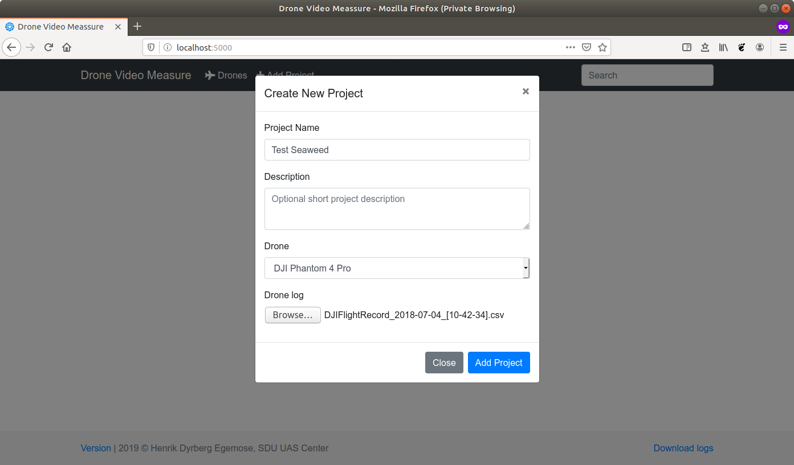
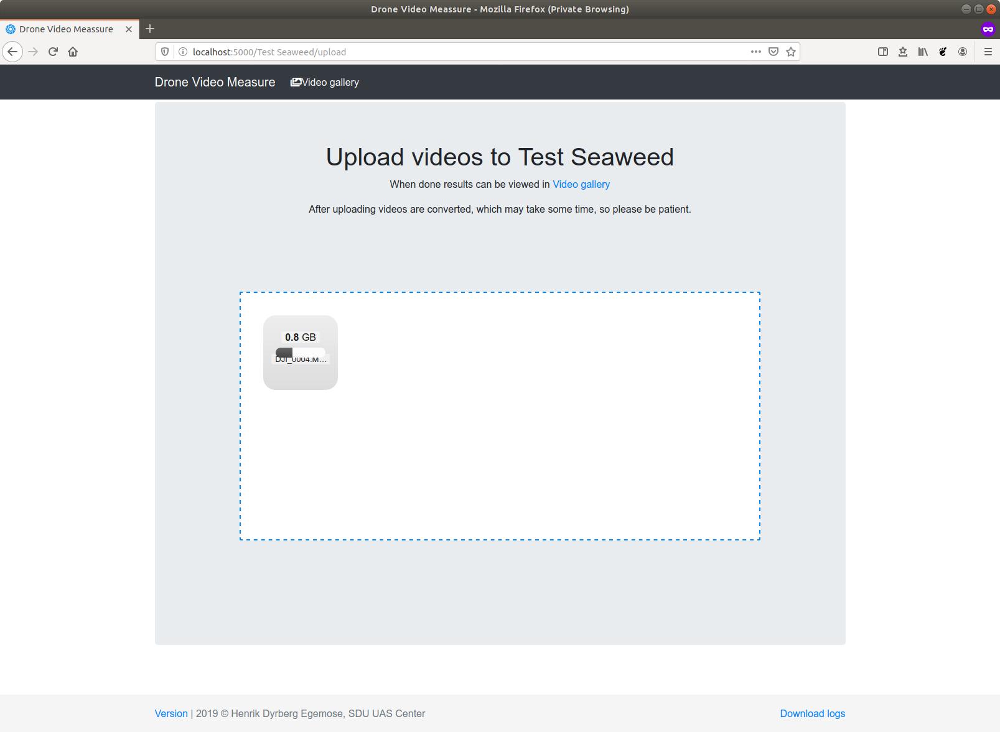
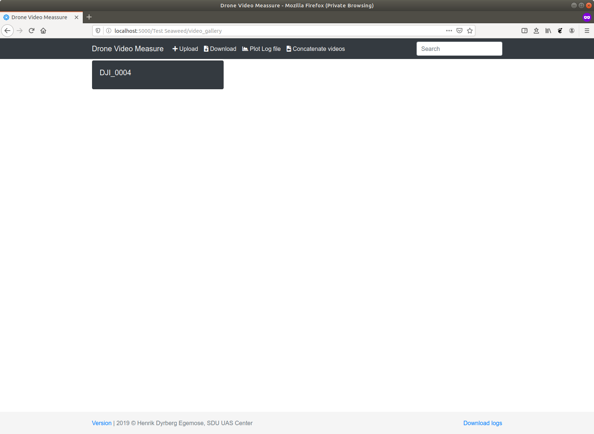
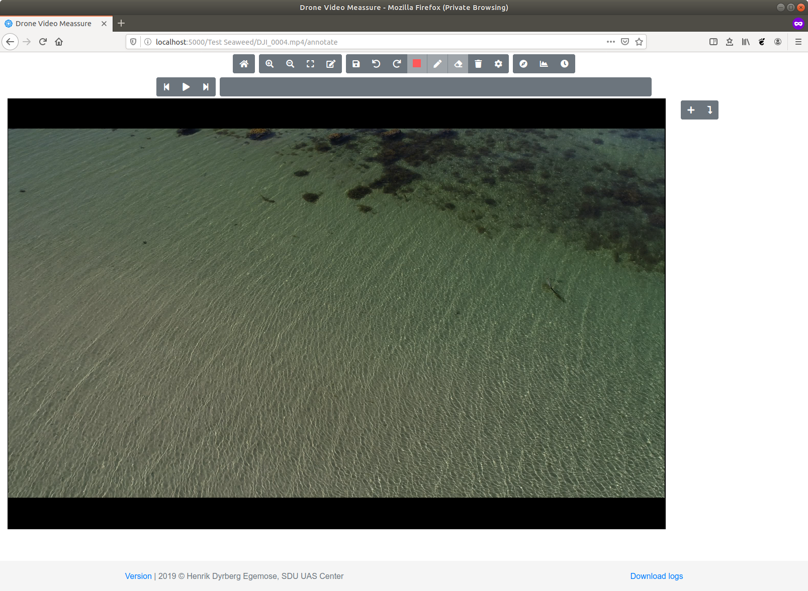
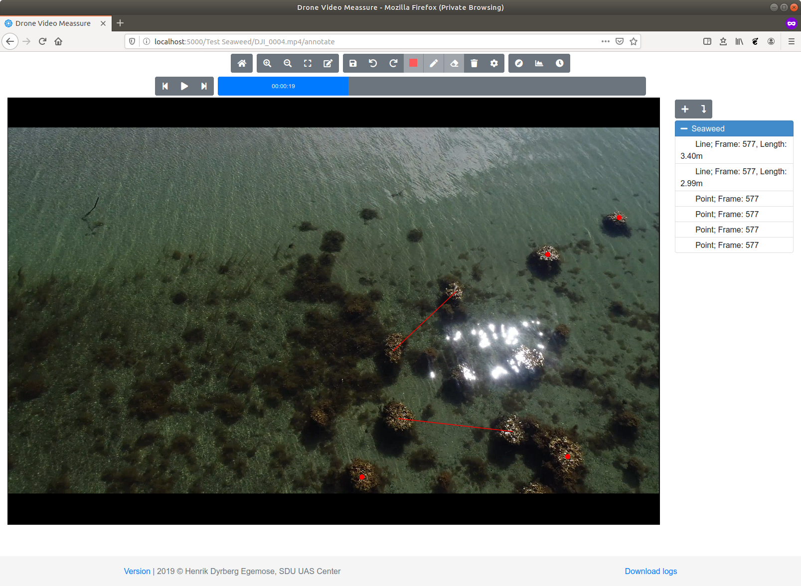
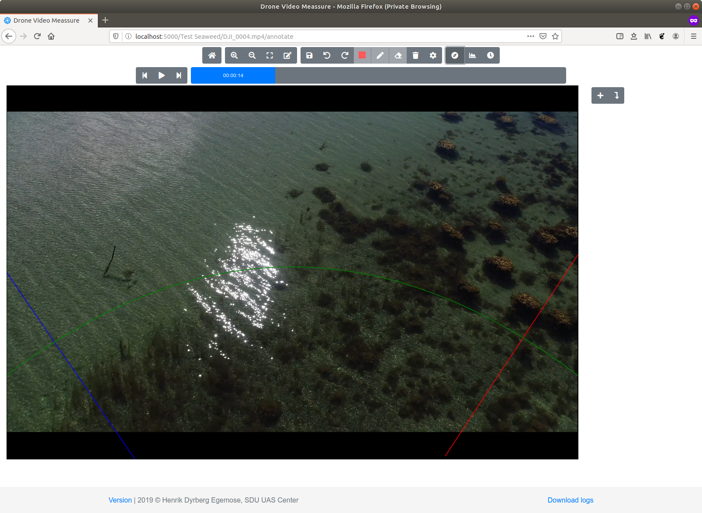
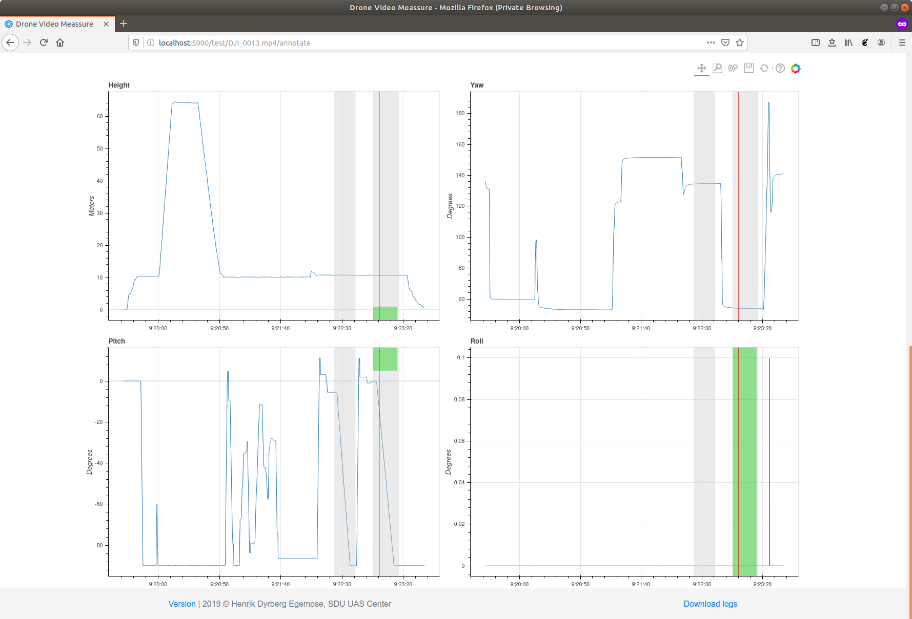

# User Manual

This is a short guide on how to use the DroneVideoMeasure program.
Given a matching flight log (from a DJI drone) and video of a marine animal, e.g. a
harbor porpoise, the program lets the user to track the position of the
marine animal and estimate its length.

## Installation

To install the program, please follow the [installation guide](../README.md).

## Acquire Flight Logs

To get the flight logs from a DJI drone the following guide can be used.

* [HOW TO: Retrieve DJI Phantom Flight Logs from an Apple Device](https://www.phantomhelp.com/tips/how-to-retrieve-dji-go-flight-logs-from-itunes.29)

The flight log needs to be converted to csv format and can be done by uploading the flight log to [PhantomHelp](https://www.phantomhelp.com/LogViewer/Upload/) and Downloading the verbose csv.

## Using the Program

An example data set is available on  including a demo video.

The program is opened in a browser and the main page looks like:

By clicking on "Drone Video Measure" you are returned to the main page.

### Calibrating a Drone

First a drone needs to be calibrated and this is done by:
* Under the menu "Drones" and by clicking "Add Drone"
* Add the drone with a name and description
* Clicking "Calibrate Caemra" opens a page to upload a video or set of images taken by the Drone of a checkerboard (like this [checkerboard.png](checkerboard.png)) from different angles are supplied to calibrate the drone camera. See the calibration video from the example data set.
* The calibration can take a few minutes depending on the video length or number of images.
* The calibration parameters can be viewed afterwards by clicking "View Calibration"

### Creating a Project

The program uses projects for organization. A project will correspond to one flight, and uses one flight log, but can use multiple videos.

* First a project is created, by clicking "Add Project"
* It is given a name and a description. The drone used for the flight is selected and the flight log in csv format is uploaded.

* When the project are added, videos can be uploaded. Videos are converted for better performance and the upload may take some time.

* When upload and conversion is done, the videos can be viewed by clicking on "Video gallery"

### Annotating on Video

Clicking on a video in the Video Gallery will open the video.

In the top are the controls for playing the video and making annotations. The controls left to right are, with shortcuts in parentheses:

First row:
* Home: Return to the video Gallery. Annotations are automatically saved.
* Zoom in (+)
* Zoom out (-)
* Return to normal zoom level. (0)
* Toggle annotation mode
* Save annotations.
* Undo last annotation (ctrl-z)
* Redo last undo.
* If an annotation is selected, change the color
* If an annotation is selected, change the line width
* If an annotation is selected, delete it.
* Remove all annotations.
* Change default color and line width
* Show a artificial horizon/compass
* Show the flight log data
* Change the start time of the video in the flight log

second row:
* Skip to previous frame (p)
* Play/Pause video (space)
* Skip to next frame (n)
* Video play bar (click to jump in video)

Right column:
* Add annotation label
* If annotation in list is selected, jump to frame containing annotation.
* List of all annotations sorted by label and creation time.
* To add a annotation to a specific label, select that label before making the annotation.

On video:
* Scroll wheel to zoom in and out
* If annotation mode off, Drag to move video
* If annotation mode on, Drag to draw a line
* If annotation mode on, Click to mark a point
* If annotation selected, it can be resized and moved

#### Artificial Compass and Flight Log Plot

If the video and flight logs are not matched correctly the results will be invalid. To easily check if the video and flight logs are matched two help utilities are provided. The first are a artificial "compass" that can be displayed on top of the video.

The artificial compass contains the following elements:

* Horizontal line (pitch = 0), shown with a green line
* Negative 45 degree pitch line (pitch = -45 degree), shown with a green curved line
* East/west direction indicator, shown with a blue line
* and a north south direction indicator, shown with a red line.

When playing back the video, it is important to observe the artificial compass and see if it follows the motion of the camera. If the artificial compass moves independently of the camera, it indicates that the video and flight log is not matched properly

The flight log data can also be plotted, where the height and orientation is shown. Video recordings are showed as gray bars in the plots, and if currently playing a video a green bar is shown to indicate where the video is matched in the flight log and a red bar show the current position in the video and flight log.

### Exporting data to csv file

All the data from a project can be downloaded by clicking "Download" on the Video Gallery page. The downloaded csv file will contain the following columns:

* Name, the name of the annotation object
* time, time of the observation
* length, the length of the annotated object (is only provided if a length has been measured)
* lat, latitude of the object
* lon, longitude of the object
* east, in UTM coordinates
* north, in UTM coordinates
* zone number, in UTM
* zone letter, in UTM
* image_x, relative image coordinate of annotations center
* image_y, relative image coordinate of annotations center
* video name, name of video file
* project, name of project
* pro. version, version of the program used. (only useful for debugging)
